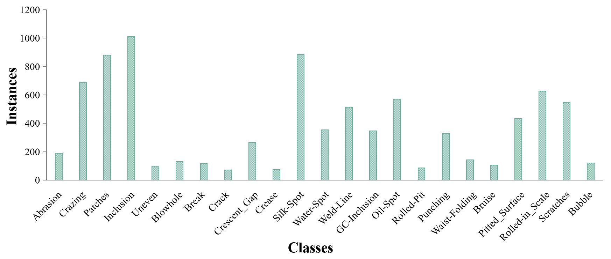

<h1 style="text-align: center;">DEFECT-YOLO: Enhanced Metal Surface Defect Detection</h1>

## Table of Contents
1. [Overview](#1-overview)
2. [Key Features](#2-key-features)
3. [Performance Highlights](#3-performance-highlights)
4. [System Requirements](#4-system-requirements)
5. [Training Configuration](#5-training-configuration)
6. [Getting Started](#6-getting-started)
    - [Dataset Preparation](#dataset-preparation)
        - [Dataset Sources](#dataset-sources)
        - [Dataset Distribution](#dataset-distribution)
        - [Dataset Splitting](#dataset-splitting)
        - [Distribution Analysis](#distribution-analysis)
    - [Installation & Usage](#installation--usage)
7. [References](#7-references)
8. [License](#8-license)


## 1. Overview

**DEFECT-YOLO** is an advanced model designed to improve the detection of metal surface defects by tackling challenges such as inter-class similarity and intra-class variance. Based on the YOLOv8s architecture, DEFECT-YOLO introduces several key enhancements that significantly boost accuracy and efficiency in detecting multiple types of metal defects.

## 2. Key Features
- **Effective Multi-scale Downsampling Convolution Module (EMDCM):** Enhances detection accuracy with minimal parameter overhead.
- **Atrous Spatial Pyramid Pooling with Efficient Multiscale Attention (ASPPE):** Increases the model's ability to capture local features.
- **Multi-branch Coordinate Attention (MCA):** Improves feature extraction for more precise defect detection.
- **Normalized Wasserstein Distance (NWD) Loss Function:** Combines localization and Complete Intersection over Union (CIoU) losses for superior small target defect detection.

## 3. Performance Highlights
- **Mean Average Precision (mAP@0.5):** Achieves a 3.6% improvement over baseline models.
- **Minimal Parameter Increase:** Only 1.64M additional parameters.
- **Inference Speed:** Optimized for real-time detection in industrial applications.

## 4. System Requirements
- **Operating System:** Ubuntu 18.04
- **CPU:** Intel(R) Core(TM) i9-10900X CPU @ 3.70GHz
- **GPU:** NVIDIA RTX 3090Ti (24GB)
- **Programming Language:** Python 3.8.16
- **IDE:** Visual Studio Code
- **Deep Learning Framework:** PyTorch 2.0.0
- **GPU Support:** CUDA 11.7
- **Virtual Environment:** Anaconda 4.13.0
- **Framework Version:** Ultralytics 8.0.114

## 5. Training Configuration
- **Epochs:** 300
- **Batch Size:** 32
- **Initial Learning Rate:** 1e-2
- **Momentum:** 0.937
- **Weight Decay:** 1e-4
- **Threads:** 12
- **Optimizer:** Stochastic Gradient Descent (SGD)

For more details, refer to the configuration file:  
`./DEFECT-YOLO/DEFECT-YOLO-CODE/ultralytics/cfg/default.yaml`

---

## 6. Getting Started

### Dataset Preparation

#### Dataset Sources
DEFECT-YOLO leverages data from the following curated sources:
- **Aluminum Defect Dataset**
- **Magnetic Tile Surface Defects Dataset**
- **GC-DET Dataset**
- **NEU-DET Dataset**

The dataset contains various common metal surface defects, refined by field experts through re-annotation and the exclusion of low-quality samples.

#### Dataset Distribution
Below is the distribution of defect categories in the DEFECT-DET dataset:



| **Defect Type**      | **Abbreviation** | **Quantity** |
|---------------------|------------------|--------------|
| Abrasion            | AB               | 188          |
| Crazing             | CR               | 689          |
| Patches             | PA               | 881          |
| Inclusion           | IN               | 1011         |
| Uneven              | UN               | 99           |
| Blowhole            | BH               | 129          |
| Break               | BK               | 117          |
| Crack               | CK               | 70           |
| Crescent Gap        | CG               | 265          |
| Crease              | CE               | 74           |
| Silk-Spot           | SS               | 884          |
| Water-Spot          | WS               | 354          |
| Weld-Line           | WL               | 513          |
| GC-Inclusion        | GI               | 347          |
| Oil-Spot            | OS               | 569          |
| Rolled-Pit          | RP               | 85           |
| Punching            | PU               | 329          |
| Waist-Folding       | WF               | 143          |
| Bruise              | BZ               | 106          |
| Pitted Surface      | PS               | 432          |
| Rolled-in Scale     | RS               | 628          |
| Scratches           | SC               | 548          |
| Bubble              | BU               | 119          |


#### Dataset Splitting

The dataset is split into training, validation, and test sets in an 8:1:1 ratio.

| **Split**   | **Total** | **Train** | **Validation** | **Test** |
|-------------|:---------:|:---------:|:--------------:|:--------:|
| **Images**  | 5748      | 3834      | 427            | 474      |

#### Distribution Analysis
- **Center Point Coordinates Distribution:**
  Labels are predominantly located near the center of the images, with darker colors indicating higher density.
  

- **Width and Height Distribution of the Instance Box:**
  Most defects are small, concentrated in the lower-left corner of the distribution. Larger aspect ratios show fewer samples, with some extreme values at the ends.
  

---

## 7. Installation & Usage

### Clone the Repository and Set Up the Environment

```bash
# Create a virtual environment
conda create -n DEFECT-YOLO python=3.9.12

# Activate the environment
conda activate DEFECT-YOLO

# Clone the repository
git clone https://github.com/Dafei-Zhang/DEFECT-YOLO.git

# Navigate to the project directory
cd DEFECT-YOLO-CODE

# Install dependencies
pip install -e .
pip install -r requirements.txt

# Preprocess the dataset
python DEFECT-DET-Dataset/preprocess_dataset.py
```

Before preprocessing:
```
|--images
   |--test
      |--test1.zip
      |--test2.zip
      `--test...zip
   |--train
      |--train1.zip
      `--train...zip
   |--val
      |--val1.zip
      `--val....zip
```

After preprocessing:
```
|--images
   |--test
      |--img1.jpg
      |--img2.jpg
      `--img...jpg
   |--train
      |--img1.jpg
      |--img2.jpg
      `--img...jpg
   |--val
      |--img1.jpg
      |--img2.jpg
      `--img...jpg
```

### Training & Testing

- **Train the model:**

  ```bash
  python train.py
  ```

- **Validate/test the model:**

  ```bash
  python val.py
  ```

---

## References

1. **Tianchi Platform (2023).** Aluminum Defect Dataset. [Tianchi](https://tianchi.aliyun.com) (accessed August 2, 2023).
2. **Huang, Y. B., et al. (2018).** Surface Defect Saliency of Magnetic Tile. *IEEE CASE*. [DOI: 10.1109/COASE.2018.8560423](https://doi.org/10.1109/COASE.2018.8560423)
3. **Lv, X. M., et al. (2020).** Deep Metallic Surface Defect Detection. *Sensors*. [DOI: 10.3390/s20061562](https://doi.org/10.3390/s20061562)
4. **Song, K. C., et al. (2013).** Completed Local Binary Patterns for Steel Strip Surface Defects. *Applied Surface Science*. [DOI: 10.1016/j.apsusc.2013.09.002](https://doi.org/10.1016/j.apsusc.2013.09.002)
5. **Hou, Q. B., et al. (2021).** Coordinate Attention for Efficient Mobile Network Design. *IEEE CVPR*. [DOI: 10.1109/CVPR46437.2021.01350](https://doi.org/10.1109/CVPR46437.2021.01350)
6. **Wang, J. W., et al. (2021).** A Normalized Gaussian Wasserstein Distance for Tiny Object Detection. *arXiv preprint*. [DOI: 10.48550/arXiv.2110.13389](https://doi.org/10.48550/arXiv.2110.13389)

---

## License

Distributed under the MIT License. See `LICENSE` for more information.